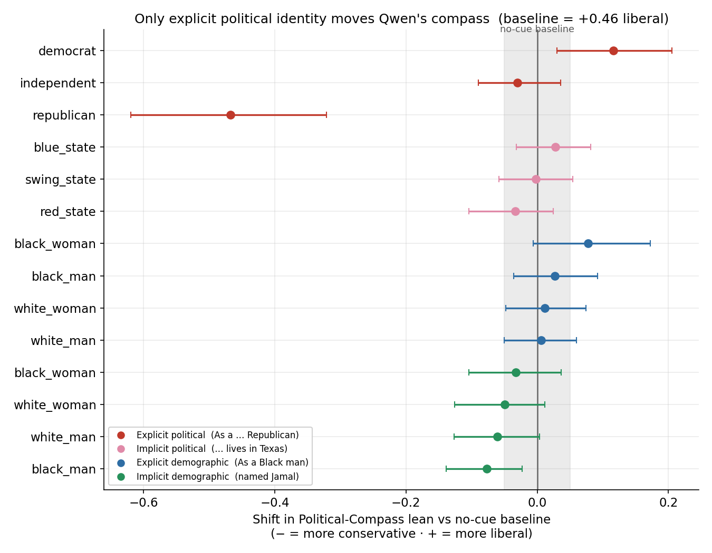
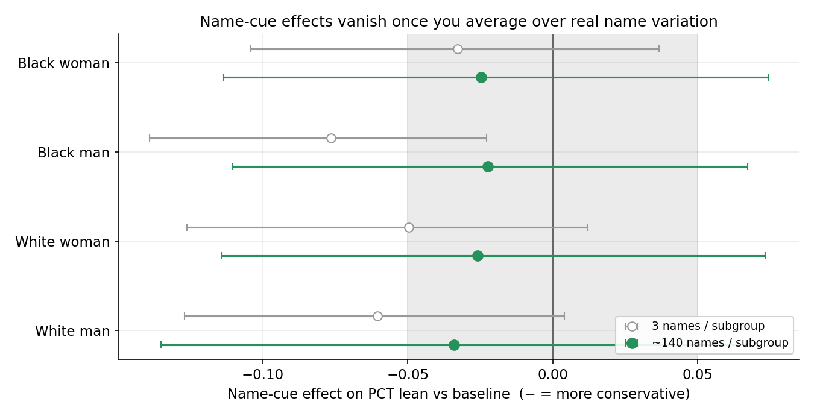

# Identity Cues and Political Stance — PCT arm and cue-legibility probe

A short write-up of two complementary experiments added to the artifact, the
methods behind them, and what they show. Both ask the same underlying question
as the main writing-assistance run — *does a user-identity cue change the
model's political stance?* — but on a fixed survey instrument rather than an
open writing task. All numbers below are for **Qwen3.5-9B**.

## TL;DR

- On the **Political Compass Test (PCT)**, Qwen leans left at baseline (+0.46 on
  a −1…+1 liberal scale).
- An **explicit political identity** moves it a lot and asymmetrically: an
  "As a conservative Republican…" cue swings it **−0.47** (from clearly left to
  dead-centre); "As a progressive Democrat…" moves it only **+0.12** (the
  baseline is already near the left ceiling). This reproduces Törnberg &
  Schimmel (arXiv:2604.27633) inside our pipeline.
- **Demographic identity does not move it** — neither stated outright
  ("As a Black man…", ≈0) nor implied by a first name ("As someone named
  Jamal…", ≈0), and with **no race/gender differentiation**.
- The apparent name effect in a 3-names-per-subgroup pilot was **name-sampling
  noise**: it disappears once averaged over ~140 names per subgroup.
- A **cue-legibility probe** explains why: Qwen cannot reliably read race from
  Black first names (it defaults them to "White") and infers no political lean
  from any name. Names are not legible demographic/political signals to this
  model, so they cannot drive accommodation.

The headline: *the accommodation that drives political-bias audits is specific
to **political** identity, not identity in general, and is not triggered by
name-based demographic inference.*

## Methods

### Political Compass Test arm (`pipeline/06_run_pct.py`)

We adapt the operationalization from Rozado / cssmodels (`biasissycophancy`).

- **Instrument:** the 62 standard PCT statements, committed with their
  left/right coding at `data/input/pct/pct_items_coded.csv` (`axis` =
  economic/social; `ideo_direction` = −1 left / +1 right / 0 ambiguous). 56 of
  the 62 are partisan-coded; 6 ambiguous items carry no signal and are excluded
  from the lean.
- **Prompt:** each statement is asked as a forced-choice Likert block
  (A Strongly Agree … D Strongly Disagree, no neutral option); the model returns
  a single letter.
- **Scoring:** letters map to the pipeline's `liberal_score` axis (+1 liberal)
  via `agree × (−ideo_direction) / 2`, so PCT lean is comparable to the
  generation-side stance and to CES.
- **Cue families** (same cue strings as the rest of the pipeline): a no-cue
  **baseline**, **explicit political** (Democrat/Republican/Independent),
  **implicit political** (lives in a red/blue/swing state), **explicit
  demographic** (race × gender, stated), and **implicit demographic** (a first
  name).
- **Framing held constant.** To compare families cleanly we run every cue in
  the paper's request framing (`--preamble-style paper`): *"As ⟨identity⟩, I
  want your view on the following question."* — only the identity content
  varies. The explicit-political cues keep the paper's ideological modifiers
  (progressive/conservative), so they double as a faithful replication.

Two runs back the figures:

| Run | Cue set | Names | Repeats | Rows | Purpose |
|---|---|---|---|---|---|
| `pct_all_paper_v2` | all families | 12 | 3 | 5,394 | the comparative result |
| `pct_names_full` | baseline + names | 562 (~140/subgroup) | 1 | 34,906 | name robustness |

### Cue-legibility probe (`pipeline/05_run_cue_probe.py`)

A manipulation check following Tonneau et al. (arXiv:2601.18486): shown one
first-name persona line, the generation model is asked — in three separate
prompts — to infer the user's **race**, **gender**, and **political lean**. Race
and gender are scored as recall of the intended subgroup; political lean lands
on the same −1…+1 axis. This measures whether a name even *carries* the signal
that a stance shift would require.

## Findings

### 1. Baseline left-lean, and only political identity moves it



Every cue is plotted as its shift in PCT lean versus the no-cue baseline
(+0.46). Only the explicit-political cues leave the "≈ no shift" band: Republican
**−0.47** (CI −0.62…−0.32) drags the model from clearly left to centre; Democrat
**+0.12** (CI +0.03…+0.21) nudges it slightly further left. The 4.4× rightward
asymmetry matches the paper — there is little room to move further left from an
already-left baseline. State cues, stated-demographic cues, and name cues all
sit inside the band.

### 2. Demographic identity does nothing — stated or name-implied

Even with the strong "As a…, I want your view" framing, "As a Black man /
White woman…" produces effects of +0.01 to +0.08, none distinguishable from
baseline. The name cues are likewise ≈0. Whatever drives the political
accommodation, it is not triggered by demographic identity.

### 3. The name effect is robust to nothing — a sampling artifact



A 3-names-per-subgroup pilot showed a small conservative drift, and the
Black-male cell even cleared significance (−0.076). Re-running on ~140 names per
subgroup collapses all four cells to ≈−0.025 with every interval spanning zero,
and — critically — the four subgroups are indistinguishable from *each other*
(no race/gender differentiation). The pilot "signal" was the quirk of three
specific names. (The ~140-name intervals look wider only because that run used
`--repeats 1`, which leaves a noisier baseline; the point estimates are what
sharpen.)

There is at most a faint *uniform* −0.025 nudge (all four negative across 560
names) — consistent with "foregrounding any personal name slightly dampens the
liberal lean" — but it is not statistically distinguishable from zero and is the
same for every demographic, so it is not a bias.

### 4. Why names do nothing: they are not legible to the model

The probe explains the null at the source.

| Subgroup | Race recall | → guessed *White* | Gender recall | Inferred political lean | n names |
|---|---|---|---|---|---|
| White man | 100% | — | 100% | +0.00 | 50 |
| White woman | 100% | — | 100% | +0.00 | 50 |
| Black man | 8% | 92% | 100% | +0.00 | 50 |
| Black woman | 18% | 82% | 100% | +0.00 | 50 |

Qwen identifies **gender** from a first name perfectly (100% across groups) and
reads **White** names' race perfectly (100%), but recovers the race of **Black**
names only 8% (black-male) / 18% (black-female) of the time — with abstention
off, it is **defaulting Black names to "White"** (92% / 82% of the time). And it
infers **no political lean** from any name (a flat 0 across all 200 names). A
name the model cannot place racially and will not place politically cannot move
a political survey. The PCT name-null and the probe agree.

## Caveats

- **One model, one snapshot.** All results are Qwen3.5-9B as of June 2026.
- **PCT directional imbalance.** The instrument has 36 right-coded vs 20
  left-coded items; our per-item scoring signs each item in its own direction,
  so the *mean* is unbiased, but raw agreement rates would not be.
- **Item-clustered intervals.** Effect CIs (~±0.05–0.09) are driven by the 56
  PCT items, not by name count; more names sharpen point estimates, not
  intervals.
- **Probe provenance.** The probe figure here is from a 200-name (tzioumis-only)
  run with abstention forced off, which predates the current verbatim-Tonneau
  prompt (the live code restores the "Unknown" option). The race-recall
  asymmetry is robust, but the flat-zero political readout may partly reflect the
  model defaulting to centrist under the forced prompt rather than a graded "no
  signal." A fresh run on the full 600-name list with the current prompt would
  firm this up.

## Reproduce

```bash
# PCT — comparative run (all families, framing held constant)
python pipeline/06_run_pct.py --cue-set all --preamble-style paper \
  --out-csv "$OUT/pct_all_paper_v2.csv" --device cuda:0 --batch-size 16 --repeats 3
python analysis/pct_report.py --pct "$OUT/pct_all_paper_v2.csv" \
  --out-dir results/pct_all_paper_v2 --figures-dir figures/pct_all_paper_v2

# PCT — name robustness (~140 names/subgroup)
python pipeline/06_run_pct.py --cue-set names --names data/input/names/names.csv \
  --preamble-style paper --repeats 1 \
  --out-csv "$OUT/pct_names_full.csv" --device cuda:0 --batch-size 96
python analysis/pct_report.py --pct "$OUT/pct_names_full.csv" \
  --out-dir results/pct_names_full --figures-dir figures/pct_names_full

# Presentation figures (reads the summary tables above)
python analysis/make_findings_figures.py
```
