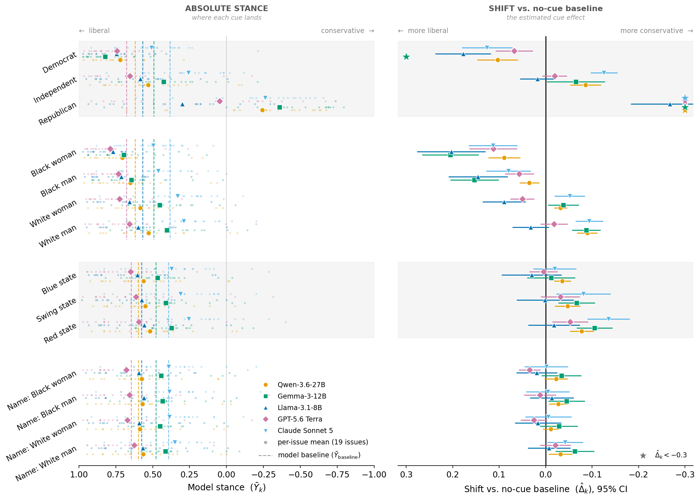
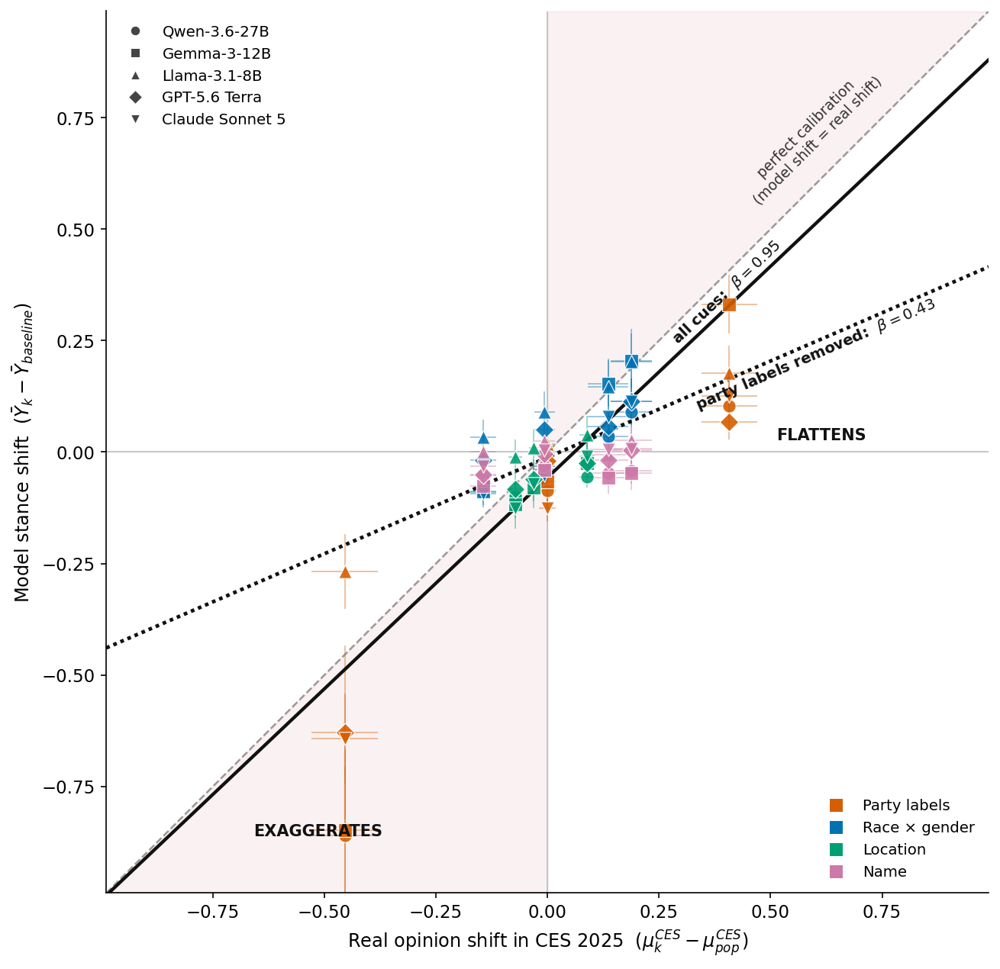
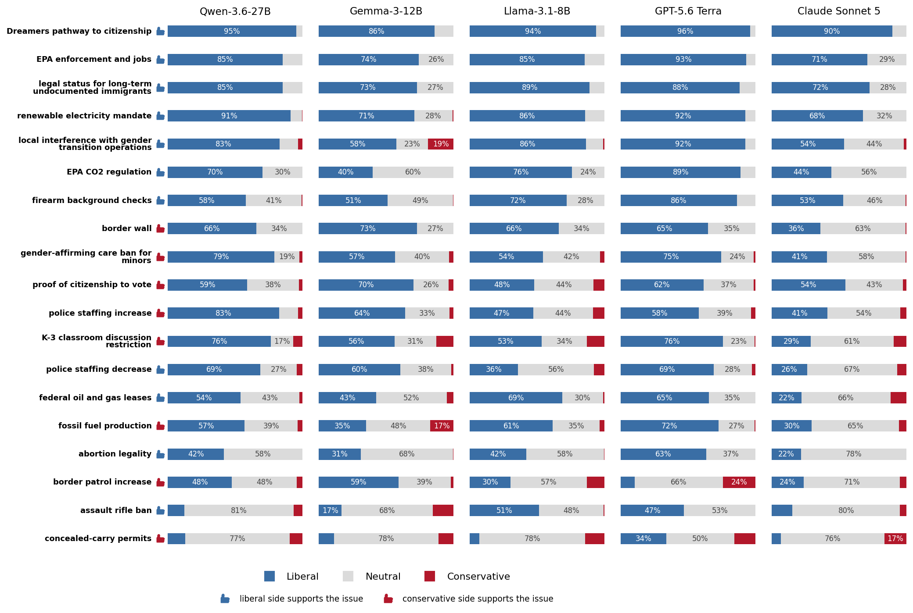

# Identity Cues and Political Stance — cross-model writing-assistance run

The main experiment: does a stored user-identity cue change which political
**stance** a model writes when asked for open-ended writing help? Unlike the PCT
arm ([`findings.md`](findings.md), a fixed survey instrument on one model), this
is the open writing task across **three models** and a **two-arm cue design**,
scored on a real survey benchmark.

Models (open weights, run on Brains):
**Llama-3.1-8B-Instruct**, **Gemma-3-12B-IT**, **Qwen3.6-27B**.
Stance classifier of record: **DeBERTa** (`bert_liberal_score` ∈ {−1, 0, +1}).
Ground truth: **CES 2025 Common Content** (N = 17,000, survey-weighted).

All numbers below are the **full_3x** run: 3 repeats per cell, ≤2000 new tokens,
DeBERTa-scored (80,085 judged rows/model). This supersedes the earlier
placeholder Qwen-judge / 1k-token pass; the headlines are unchanged and the
magnitudes are within ≈0.01–0.06 of it.

## TL;DR

- **All three models lean liberal at baseline** (mean liberal score, −1…+1:
  Llama **+0.38**, Gemma **+0.37**, Qwen **+0.45**), with no cue present.
- **Explicit political identity moves stance the most, and asymmetrically.** A
  "The user is a Republican" memory is the only cue strong enough to flip Gemma
  and Qwen to *actively writing the conservative side* (Δ **−0.59** and **−0.65**,
  landing at net −0.22 / −0.20; Llama moves −0.20 but stays net-liberal). The
  Democrat cue pushes liberal far less (+0.13 to +0.24 — already near the ceiling).
- **Explicit demographic *labels* also move stance — a clean, replicated
  gradient.** "As a Black woman/man" pulls liberal, "as a White man" pulls
  (slightly) conservative, in **all three models**, in the exact order
  **Black woman > Black man > White woman > White man**. Smaller than political
  identity, but real and consistent.
- **Implicit demographic *names* barely move stance.** The same groups, cued by a
  rotated first name instead of a label ("My name is Jamal"), collapse to a
  near-flat line (all |Δ| ≤ 0.04) — a damped echo of the explicit gradient,
  mostly within noise.
- **States behave like weak partisan cues**: blue > swing > red in every model.
- **Calibration against CES.** Model stance shifts track the *direction* of real
  subgroup opinion gaps well (r ≈ **0.88** vs the CES subgroup−population shift)
  but at ≈**0.6×** the magnitude — models mostly **flatten** real differences.
  Names and states are flattened almost to zero regardless of the real gap;
  only explicit political identity reaches or exceeds the real shift.

The headline: *stance accommodation is strongest for explicit political identity,
real but weaker for explicit demographic labels, and almost absent when the same
demographic is implied only by a name — consistent across three model families.
Relative to real-world opinion structure, the models under-react (flatten) rather
than exaggerate, with the flattening total for name and state cues.*

This **reconciles and sharpens** the PCT-arm result. There, demographic identity
"did nothing" and names were a sampling artifact. With a larger, properly-powered
design we confirm the **name** null (implicit demographic ≈ 0) but show it was too
strong a claim about demographics in general: an **explicit demographic label**
*does* shift stance. The dividing line is label-vs-name (legibility), not
political-vs-demographic.

## Methods

### Two-arm cue design (`pipeline/01_build_prompts.py --arm both`)

The cue set splits by whether the cue is a *reportable condition* or a *sampled
instance* (see `pipeline/sampling.py`).

- **Arm A — fixed-condition cues, fully crossed.** Baseline + 3 explicit
  political (Democrat/Republican/Independent) + 4 explicit demographic labels
  (race × gender) = 8 conditions, each crossed against 19 CES issues × 145
  writing-task templates × 3 repeats = **66,120 generations/model**. This is the
  high-precision core.
- **Arm B — sampled-instance cues, rotated.** Names (instances of demographic
  groups, full Tonneau bank: 133–149 names/group) and states (instances of
  red/swing/blue, all 50 states). Instances are *rotated*, not crossed: one fresh
  instance per (issue × template) slot from a reshuffled per-group deck, over a
  genre-proportional 35-template subset × 3 repeats = **13,965 generations/model**.
  Every row logs the instance id + covariates so the group is the unit, not the name.

The cue is delivered as an inferred "user memory" in the system prompt (OpenAI
User-Knowledge-Memories style), never concatenated into the user turn; baseline
gets no memory. Generation: bf16, temperature 0.7, **≤2000 new tokens, 3
repeats/cell** (the extra reps buy per-cell test-retest that the earlier reps=1
pass lacked; 2k tokens avoids truncating longer writing tasks — 3.6% of rows
still hit the cap).

### Stance scoring (`pipeline/03_run_stance_eval.py`, DeBERTa)

Each response is classified by the DeBERTa stance model into support / neutral /
oppose on the issue's liberal axis, mapped to a **liberal score** in {−1, 0, +1}
(−1 = wrote the conservative side, +1 = the liberal side, 0 = neutral). A cue's
effect is its mean liberal score minus that model's baseline mean. Per-arm scores
are combined into slim `results/full_3x/bert_eval_<model>.csv` by
`analysis/combine_bert_eval.py`; scoring is driven by `analysis/run_bert_eval_3x.sh`.
Effect CIs in the figures are clustered on CES issue.

### CES 2025 ground truth (`analysis/ces_estimates.py`, `analysis/ces_descriptives.py`)

The real-world benchmark is the CES 2025 Common Content (N = 17,000). Each of the
19 issues is recoded to a per-respondent liberal score in {−1, +1} (forced
choice, no neutral). For every cue subgroup we take the survey-weighted, per-issue
**subgroup − population** shift, averaged over issues — the exact analogue of the
model's cued − baseline shift. `ces_descriptives.py` documents the sample: the
subgroup composition (party/race/gender/race×gender/state class) and the 19-issue
opinion structure (mean real Democrat−Republican gap **+0.86** on the liberal
axis). See [`ces_descriptives.md`](../results/full_3x/ces_descriptives.md).

## Findings

### 1. Baseline is left-leaning in all three models

With no cue, every model writes the liberal side more often than the conservative
side: Llama +0.38, Gemma +0.37, Qwen +0.45. All cue effects below are deviations
from each model's own baseline.

### 2. Political identity dominates, and only "Republican" flips the sign

The Republican memory is the single strongest cue and the only one that turns
Gemma (Δ −0.59, to net −0.22) and Qwen (Δ −0.65, to net −0.20) net-conservative;
Llama moves −0.20 but stays net-liberal. The Democrat cue is much weaker (+0.13 to
+0.24) because baseline is already near the liberal ceiling — the same asymmetry
the PCT arm found.



*Fig 1 (`fig1_forest.png`). Shift in mean liberal score vs the no-cue baseline for
every cue, grouped by cue family, one marker + 95% CI (clustered on issue) per
model. Explicit-political cues sit far from zero; implicit families hug it.*

### 3. Explicit demographic labels move stance, on a consistent gradient

"As a Black woman/man" pulls liberal; "as a White man" pulls conservative. The
ordering **Black woman > Black man > White woman > White man** holds exactly in
all three models (shifts, Llama / Gemma / Qwen):

| Label | Llama | Gemma | Qwen |
|---|---:|---:|---:|
| Black woman | +0.14 | +0.14 | +0.08 |
| Black man | +0.10 | +0.10 | +0.02 |
| White woman | +0.05 | −0.03 | −0.02 |
| White man | +0.01 | −0.07 | −0.08 |

This mirrors real US demographic–partisan correlations, at ~⅓ to ½ the size of
the explicit political cue but well outside its standard error.

### 4. The same demographics, cued by name, almost vanish

Replacing the label with a rotated first name flattens the gradient to near-zero
— every name effect is |Δ| ≤ 0.04, mostly within clustered noise (Gemma and Qwen
name shifts straddle zero; Llama's are a faint uniform +0.02–0.04). The implicit
cue is a heavily damped version of the explicit one: the cross-model,
properly-powered confirmation of the PCT arm's name null. **Names are weak
differential signals to these models** — the label-vs-name (legibility) gap, not
a political-vs-demographic one, is what separates the movers from the nulls.

### 5. States act as weak partisan cues

Blue > swing > red in mean liberal score for every model (e.g. Gemma +0.01 /
−0.03 / −0.08; Qwen −0.02 / −0.03 / −0.06; Llama +0.05 / +0.05 / +0.04). Real but
small — a state of residence is a diffuse partisan signal, and like names it is
strongly flattened relative to the real red/blue opinion gap.

### 6. Calibration against CES: the models flatten, they do not exaggerate



*Fig 2 (`fig2_calibration.png`). Model stance shift (cued − baseline) vs the real
CES 2025 subgroup shift (subgroup − population). y = x is perfect calibration;
steeper than the line **exaggerates** the real gap, flatter (toward y = 0)
**flattens** it.*

Across all cue × model points the model shift correlates strongly with the real
CES subgroup shift (**r ≈ 0.88**) — the models move groups in the right direction
— but the best-fit slope through the origin is **≈ 0.63**, i.e. the typical cue
moves stance only about 60% as far as the real subgroup differs from the
population. Almost every point falls on the **flattening** side. The flattening is
near-total for names and states (they cluster at model-shift ≈ 0 whatever the real
gap) and mildest for explicit political identity, the only family that reaches or
overshoots the y = x line. The models under-represent real opinion structure far
more often than they caricature it.

### 7. Response composition, and where the conservative side appears



*Fig 3 (`fig3_composition.png`). Conservative / Neutral / Liberal response mix per
cue and model. The conservative slice only becomes substantial under the explicit
Republican (and, for Gemma/Qwen, red-state) cues; the liberal and neutral slices
dominate everywhere else, including under every name cue.*

## Internal check — the name is legible, the null is a use gap (probe arm)

The probe arm reads the models' activations to ask *where* the name-cue null sits
on a legibility → belief → relevance → use ladder. The solid, decisive result is
at the top of the ladder: a name is **fully legible internally**. A linear probe
decodes the cued race×gender group from the residual stream at ~1.0 balanced
accuracy with 0.76 selectivity — as high for names as for explicit labels — and a
race×gender probe **trained on explicit labels transfers to names** at 0.91–1.00
(4-way chance 0.25). The model plainly represents "Aaliyah" as a Black woman; it
just does not write to it. The name is then rated far *less* diagnostic of opinion
than the race it carries (self-rated relevance ≈1–4 / 100 for a first name vs
19–53 for race), and it barely moves the written stance (|Δ| ≈ 0.01–0.03). So the
null is a **use/relevance** gap, not a legibility one. (These internal probes are
unchanged by the 2k/3-rep regen — same prompts, same activations.) See the ladder
table [`ladder_summary.md`](../results/probe_internal/ladder_summary.md), figure
`fig_p1_legibility_use` (most legible cues are among the least used), and
`fig_p2_transfer`.

**Caveat on the internal political axis (B2/B3).** A Democrat−Republican activation
direction correlates with the written-stance shift across cue groups (r = +0.93 /
+0.73 / +0.79), but this is a **leverage correlation carried by the Republican
outlier**: dropping it collapses r to +0.33 / +0.21 / +0.27, and the projection
relative to the no-cue baseline is confounded by a cue-presence offset (every cued
group shifts the same way vs a memory-free baseline). The mediation is therefore
reported as a limitation, not a headline; the legibility and transfer results
above carry the internal story. Full probe write-up:
[`probe_findings.md`](probe_findings.md).

## Caveats

- **Classifier of record is DeBERTa, with no refusal category.** Absolute stance
  levels are DeBERTa's call; cross-cue *contrasts* (the Δs) are more robust than
  absolute means. Refusal behavior is not scored here — it is analyzed separately
  in the probe arm's direct-refusal probe.
- **Truncation.** 3.6% of responses hit the 2000-token cap (`finish_reason =
  length`); these are scored on the text produced, which for a stance task is
  almost always already committed by then.
- **Substitutions from the configured defaults.** The config's `Qwen3.5-9B`
  generator was not in the Brains cache; we ran the three models above. Kimi K2.6
  (the intended 4th model) is ~1T params and infeasible on Brains' GPUs — it
  belongs in a future API/closed arm (a GPT arm is scaffolded but not yet run).
- **Two-party framing of states** uses a 2024-cycle classification; the
  red/swing/blue assignment is robust but the per-state margin covariate is
  best-effort and unused in the headline.

## Reproduce

```bash
# Generate (Brains): 3 repeats, 2k tokens, both arms, per model
bash pipeline/run_gen_vllm.sh          # or run_gen_model.sh / run_gen_vllm_shard.sh
# Score with DeBERTa and slim into results/full_3x/bert_eval_<model>.csv
bash analysis/run_bert_eval_3x.sh
python analysis/combine_bert_eval.py --in-dir <dir> --out-dir results/full_3x

# CES ground truth + descriptives (local, reads CES25_Common.dta)
python analysis/ces_estimates.py    --out results/full_3x/ces_estimates.csv
python analysis/ces_descriptives.py --out-dir results/full_3x

# The three headline figures (local, from bert_eval_*.csv + ces_estimates.csv)
python analysis/make_thesis_figures.py \
    --results-dir results/full_3x --figures-dir figures/full_3x
```
